# tailrelay

A Docker container that exposes local services to your Tailscale network. Combines **Tailscale VPN**, **Tailscale Serve** (HTTPS + TCP relays), and a **Web UI** for browser-based management.

[](https://hub.docker.com/r/sudocarlos/tailrelay)
[](https://github.com/sudocarlos/tailrelay/releases)
[](https://github.com/sudocarlos/tailrelay/blob/main/LICENSE)

## Features

- **Web UI** - Browser-based management on port 8021
- **Automatic TLS** - Tailscale Serve HTTPS relays with MagicDNS hostnames
- **HTTPS Relays** - Configure HTTPS reverse relays through the UI
- **TCP Relays** - Forward non-HTTP protocols through Tailscale Serve
- **Backup & Restore** - Save and restore configurations
- **Dual Authentication** - Token or Tailscale network authentication
- **Multi-Platform** - Docker images for amd64 and arm64

## Table of Contents

- [Features](#features)
- [Screenshots](#screenshots)
- [Why tailrelay?](#why-tailrelay)
- [Technology Stack](#technology-stack)
- [Quick Start](#quick-start)
- [Web UI](#web-ui)
- [Getting Started](#getting-started)
  - [Prerequisites](#prerequisites)
  - [Tailscale Setup](#tailscale-setup)
  - [StartOS Deployment](#startos-deployment)
- [Development](#development)
  - [Local WebUI Development](#local-webui-development)
  - [Building](#building)
  - [Testing](#testing)
- [API Reference](#api-reference)
- [Troubleshooting](#troubleshooting)
- [Contributing](#contributing)


## Why tailrelay?

tailrelay provides secure remote access to self-hosted services:

- **Secure Access**: Tailscale's VPN eliminates port forwarding requirements
- **Easy Configuration**: Web UI handles setup without manual config files
- **Automatic TLS**: Tailscale Serve terminates TLS for HTTPS relays
- **Protocol Support**: HTTP/HTTPS proxies and TCP relays for any service
- **Backup & Restore**: Save and restore configurations

Useful for accessing Start9 services like BTCPayServer, LND, electrs, and Mempool without Tor.


## Technology Stack

| Component | Purpose | Documentation |
|-----------|---------|---------------|
| **Tailscale** | VPN, MagicDNS, device authentication | [Tailscale docs](https://tailscale.com/kb) |
| **Tailscale Serve** | HTTPS reverse relays and TCP forwarding | [Serve docs](https://tailscale.com/kb/1312/serve) |
| **Web UI** | Browser-based management (Go backend, Svelte 5 + Tailwind CSS frontend) | See [Web UI](#web-ui) section |


## Quick Start

```bash
# Pull the image
docker pull sudocarlos/tailrelay:latest

# Run the container
docker run -d --name tailrelay \
  -v /path/to/data:/var/lib/tailscale \
  -e TS_HOSTNAME=myserver \
  -p 8021:8021 \
  --net bridge \
  sudocarlos/tailrelay:latest

# Access the Web UI and follow the Tailscale login link
open http://localhost:8021
```


## Web UI

The Web UI provides browser-based management on port 8021. The frontend is a single-page application built with **Svelte 5** (runes mode), **Tailwind CSS v4**, and **Vite**. All assets (JS, CSS, icons) are bundled locally -- no external CDN requests at runtime.

### Features

- **Dashboard** - Real-time Tailscale connection status and system health
- **Tailscale Management** - Connect/disconnect and view network peers
- **HTTPS Relay Management** - Add, edit, delete, and toggle HTTPS relays backed by `tailscale serve`
- **TCP Relay Management** - Add, edit, delete, and toggle TCP relays backed by `tailscale serve`
- **Backup & Restore** - Create and restore compressed tar.gz backups
- **Live Log Viewer** - Collapsible log console with SSE streaming and runtime log level control
- **Dark Mode** - System-aware theme toggle with localStorage persistence
- **Keyboard Shortcuts** - `n` (new), `r` (refresh), `b` (backups), `l` (logs), `t` (theme)

### Authentication

The Web UI uses two authentication methods:

1. **Tailscale Network Authentication**: Devices on your Tailscale network are automatically authenticated. If the container is not connected, the Web UI shows a Tailscale login link and polls until the device is connected.
2. **Token Authentication**: A token is generated on first startup at `/var/lib/tailscale/.webui_token` for scripted access or legacy flows.

### Access

The Web UI runs on port 8021:
```bash
# Via Tailscale hostname (if HTTPS is enabled)
https://your-hostname.your-tailnet.ts.net:8021

# Or via local IP
http://localhost:8021
```


## Getting Started

### Prerequisites

1. A Tailscale account with an active Tailnet ([tailscale.com](https://tailscale.com))
2. [HTTPS certificates enabled](https://tailscale.com/kb/1153/enabling-https) in Tailscale Admin console
3. Docker or Podman installed

### Tailscale Setup

1. Log into Tailscale Admin console and click [DNS](https://login.tailscale.com/admin/dns) to enable MagicDNS.
  - Tailnets created on or after October 20, 2022 have MagicDNS enabled by default.
2. Review [MagicDNS](https://tailscale.com/kb/1081/magicdns) to understand how it works.
3. Verify or set your [Tailnet name](https://tailscale.com/kb/1217/tailnet-name)
4. Scroll down and enable HTTPS under HTTPS Certificates

### StartOS Deployment

tailrelay is available as a StartOS package via [sudocarlos/tailrelay-startos](https://github.com/sudocarlos/tailrelay-startos).

**Sideloading:**

1. Download the latest `tailrelay.s9pk` from the [tailrelay-startos releases page](https://github.com/sudocarlos/tailrelay-startos/releases), or clone the repo and run `make` to build it yourself.
2. In the StartOS web UI menu, navigate to **System → Sideload Service**.
3. Drag and drop or select the `tailrelay.s9pk` file to install.
4. Once installed, navigate to **Services → Tailrelay** and click **Start**.


## Development

### Local WebUI Development

For rapid iteration without rebuilding the full Docker image:

#### 1. Build the WebUI Assets + Binary

```bash
make frontend-build   # Build Svelte SPA -> webui/cmd/webui/web/dist/
make dev-build        # Build Go binary with embedded SPA + build metadata
```

This compiles `./data/tailrelay-webui` with build metadata (version, commit, date) and embeds the SPA assets from `web/dist/`.

**Frontend dev server:**
```bash
cd webui/frontend
npm run dev           # Starts Vite dev server with hot reload
```

**Dev asset override:**
Set `WEBUI_DEV_DIR` to a directory containing a `dist/` subdirectory (e.g., `webui/cmd/webui/web`) to serve assets from disk instead of the embedded files.

**Manual build:**
```bash
cd webui
CGO_ENABLED=0 GOOS=linux go build -a -installsuffix cgo \
  -ldflags="-w -s" \
  -o ../data/tailrelay-webui ./cmd/webui
```

#### 2. Development Options

**Option A: Mount Binary (Recommended)**

Mount the local binary for instant updates:

```yaml
# compose-test.yml
services:
  tailrelay:
    volumes:
      - ./data/tailrelay-webui:/usr/bin/tailrelay-webui:ro
      - ./tailscale/:/var/lib/tailscale
```

Then restart:
```bash
docker compose -f compose-test.yml restart tailrelay
```

**Iteration workflow:**
1. Edit code in `webui/` or `webui/frontend/`
2. Run `make frontend-build` (if frontend changed)
3. Run `make dev-build`
4. Restart container
5. Test changes

**Option B: Build Development Image**

```bash
make dev-docker-build
```

This builds a Docker image using the local binary.

### Building

```bash
# Development build with local binary
make frontend-build
make dev-build
make dev-docker-build

# Production build (multi-stage)
docker buildx build -t sudocarlos/tailrelay:latest .

# Show available targets
make help
```

### Testing

The test suite is split across three layers:

#### 1. Go unit tests (no Docker required)

Covers `internal/auth`, `internal/serve`, `internal/handlers`, `internal/backup`,
and `internal/web`.

```bash
# From the repo root — uses the `make test` target
make test

# Or directly
cd webui && go test ./...

# Verbose output
cd webui && go test -v ./...
```

#### 2. Integration tests (requires Docker)

Builds the full container image and smoke-tests container startup, process presence,
port availability, Tailscale health/metrics endpoints, and Web UI API. The suite lives in `tests/integration/` and is driven by environment
variables.

```bash
# Setup (one-time)
cp .env.example .env
# Edit TAILRELAY_HOST and TAILNET_DOMAIN in .env

pip install pytest   # one-time

# Run via Make
make integration-test

# Or directly
pytest tests/integration/ -v
```

**Environment variables** (all have defaults; override in `.env` or shell):

| Variable | Default | Purpose |
|----------|---------|---------|
| `TAILRELAY_HOST` | `tailrelay-test` | Container hostname / Docker service name |
| `TAILNET_DOMAIN` | `example.com` | Tailnet domain (used for HTTPS cert checks) |
| `COMPOSE_FILE` | `compose-test.yml` | Compose file to spin up the stack |
| `BUILD_IMAGE` | `1` | Set to `0` to skip `docker compose build` |
| `IMAGE_TAG` | `sudocarlos/tailrelay:dev` | Image to build/run |
| `STARTUP_WAIT` | `8` | Seconds to wait after container start |

#### 3. CI pipeline

GitHub Actions runs all three layers automatically on push/PR to `main`:
- **frontend** job: `npm install` + `npm run build`
- **backend** job: `go vet ./...` + `go test ./...` + `go build ./...`
- **integration** job: full Docker build + `pytest tests/integration/ -v`

### Build Metadata

The `dev-build` target injects build information:

```go
var (
  version = "dev"      // Git describe output
  commit  = "none"     // Short commit hash
  date    = "unknown"  // Build timestamp (UTC)
  branch  = "unknown"  // Git branch
  builtBy = "local"    // System username
)
```

Access these in `webui/cmd/webui/main.go`.


## API Reference

The Web UI backend exposes a JSON API on port 8021. All endpoints under `/api/` require authentication except where noted. Authentication is via Tailscale network identity (100.x.y.z) or session cookie.

### Endpoint Summary

| Method | Path | Auth | Input | Description |
|--------|------|------|-------|-------------|
| `POST` | `/api/tailscale/login` | No | -- | Initiate Tailscale login, returns auth URL |
| `GET` | `/api/tailscale/poll` | No | -- | Poll login completion, sets session cookie |
| `GET` | `/api/status` | Yes | -- | Aggregate system status |
| `GET` | `/api/targets` | Yes | -- | List configured targets |
| `GET` | `/api/tailscale/status` | Yes | -- | Tailscale status summary |
| `GET` | `/api/tailscale/peers` | Yes | -- | Tailscale peer list |
| `POST` | `/api/tailscale/logout` | Yes | -- | Deauthorize Tailscale node |
| `POST` | `/api/tailscale/connect` | Yes | -- | Bring Tailscale up |
| `POST` | `/api/tailscale/disconnect` | Yes | -- | Bring Tailscale down |
| `GET` | `/api/serve/https/list` | Yes | -- | List all HTTPS relays |
| `GET` | `/api/serve/https/get` | Yes | `?id=` | Get single HTTPS relay |
| `POST` | `/api/serve/https/create` | Yes | JSON or multipart | Create HTTPS relay |
| `POST` | `/api/serve/https/update` | Yes | JSON or multipart | Update HTTPS relay (`id` required) |
| `POST` | `/api/serve/https/delete` | Yes | `?id=` | Delete HTTPS relay |
| `POST` | `/api/serve/https/toggle` | Yes | JSON `{id, enabled}` | Enable/disable HTTPS relay |
| `POST` | `/api/serve/https/reconcile` | Yes | -- | Reconcile all HTTPS relays via `tailscale serve` |
| `GET` | `/api/serve/tcp/list` | Yes | -- | List all TCP relays |
| `GET` | `/api/serve/tcp/get` | Yes | `?id=` | Get single TCP relay |
| `POST` | `/api/serve/tcp/create` | Yes | JSON | Create TCP relay |
| `POST` | `/api/serve/tcp/update` | Yes | JSON | Update TCP relay (`id` required) |
| `POST` | `/api/serve/tcp/delete` | Yes | `?id=` | Delete TCP relay |
| `POST` | `/api/serve/tcp/toggle` | Yes | JSON `{id, enabled}` | Enable/disable TCP relay |
| `POST` | `/api/serve/tcp/start` | Yes | `?id=` | Start TCP relay |
| `POST` | `/api/serve/tcp/stop` | Yes | `?id=` | Stop TCP relay |
| `POST` | `/api/serve/tcp/restart` | Yes | `?id=` | Restart TCP relay |
| `POST` | `/api/serve/tcp/reconcile` | Yes | -- | Reconcile all enabled TCP relays |
| `GET` | `/api/backup/list` | Yes | -- | List backups with metadata |
| `POST` | `/api/backup/create` | Yes | JSON `{backup_type}` | Create backup (`full` or `config-only`) |
| `POST` | `/api/backup/restore` | Yes | JSON `{filename}` | Restore from backup |
| `POST` | `/api/backup/delete` | Yes | `?filename=` | Delete backup |
| `GET` | `/api/backup/download` | Yes | `?filename=` | Download backup (`.tar.gz`) |
| `POST` | `/api/backup/upload` | Yes | multipart `backup` | Upload backup (max 32 MB) |
| `GET` | `/api/logs` | Yes | -- | Historical logs + current level |
| `GET` | `/api/logs/stream` | Yes | -- | SSE live log stream |
| `GET` | `/api/logs/level` | Yes | -- | Get current log level |
| `POST` | `/api/logs/level` | Yes | JSON `{level}` | Set log level (`debug`, `info`, `warn`, `error`) |

### HTTPS Relay Object

```json
{
  "id": "abc123",
  "hostname": "myservice",
  "port": 8080,
  "target": "192.168.1.10:3000",
  "tls": true,
  "trusted_proxies": false,
  "host_header": "",
  "enabled": true,
  "autostart": true,
  "running": true,
  "tls_error": ""
}
```

### TCP Relay Object

```json
{
  "id": "a1b2c3d4e5f6",
  "listen_port": 9000,
  "target_host": "192.168.1.10",
  "target_port": 3000,
  "enabled": true,
  "autostart": true
}
```

The `GET /api/serve/tcp/list` response wraps each relay in `{"Relay": {...}, "Running": true}`.

### Backup Info Object

```json
{
  "filename": "tailrelay-backup-20260307-120000.tar.gz",
  "size": 102400,
  "timestamp": "2026-03-07T12:00:00Z",
  "metadata": {
    "timestamp": "2026-03-07T12:00:00Z",
    "version": "v0.7.0",
    "hostname": "my-node",
    "backup_type": "full"
  }
}
```

### Error Responses

All endpoints return errors as:
```json
{
  "status": "error",
  "message": "Description of what went wrong"
}
```


## Troubleshooting

### Web UI Not Accessible

Check container status:
```bash
docker ps | grep tailrelay
```

Verify port mapping:
```bash
docker port tailrelay
```

Check logs:
```bash
docker logs tailrelay | grep -i webui
```

Verify listening port:
```bash
docker exec tailrelay netstat -tulnp | grep 8021
```

### Cannot Log In

Retrieve token:
```bash
docker exec tailrelay cat /var/lib/tailscale/.webui_token
```

Ensure you're accessing from Tailscale network or clear browser cache.

### Relay Issues (`tailscale serve`)

Check current serve status:
```bash
docker exec tailrelay tailscale serve status
```

Force reconcile from saved UI configuration:
```bash
curl -X POST http://localhost:8021/api/serve/https/reconcile
# or for TCP relays:
curl -X POST http://localhost:8021/api/serve/tcp/reconcile
```

Test target connectivity:
```bash
docker exec tailrelay nc -zv target-host target-port
```


## Contributing

Contributions welcome:

- **Issues**: [GitHub Issues](https://github.com/sudocarlos/tailrelay/issues)
- **Pull Requests**: [GitHub PRs](https://github.com/sudocarlos/tailrelay/pulls)
- **Documentation**: Help improve docs or add examples

### Development Setup

```bash
# Clone repository
git clone https://github.com/sudocarlos/tailrelay.git
cd tailrelay

# Build locally
docker build -t tailrelay:dev .

# Run tests
docker compose -f compose-test.yml up -d
```

See [Development](#development) section for WebUI development workflow.


## Release Notes

See [CHANGELOG.md](CHANGELOG.md) for the full release history.


## Screenshots

The Web UI supports light and dark themes and is fully responsive on mobile.

### Login

<table>
<tr>
  <th>Light — Desktop</th>
  <th>Dark — Desktop</th>
</tr>
<tr>
  <td>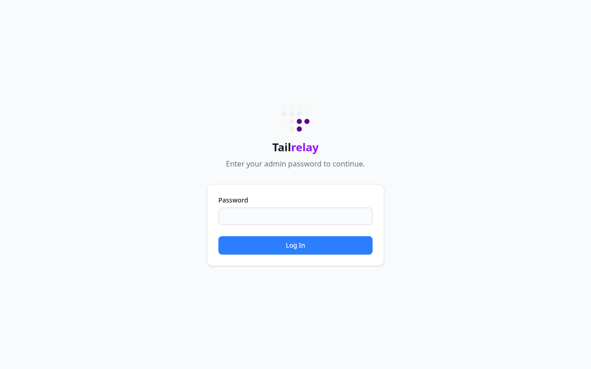</td>
  <td>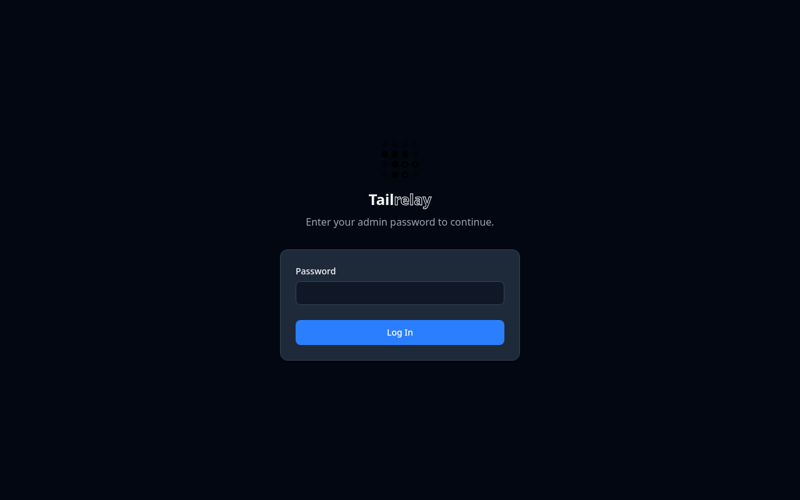</td>
</tr>
<tr>
  <th>Light — Mobile</th>
  <th>Dark — Mobile</th>
</tr>
<tr>
  <td>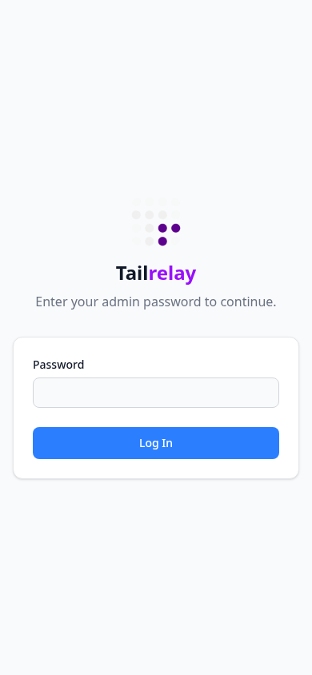</td>
  <td></td>
</tr>
</table>

### Dashboard

<table>
<tr>
  <th>Light — Desktop</th>
  <th>Dark — Desktop</th>
</tr>
<tr>
  <td>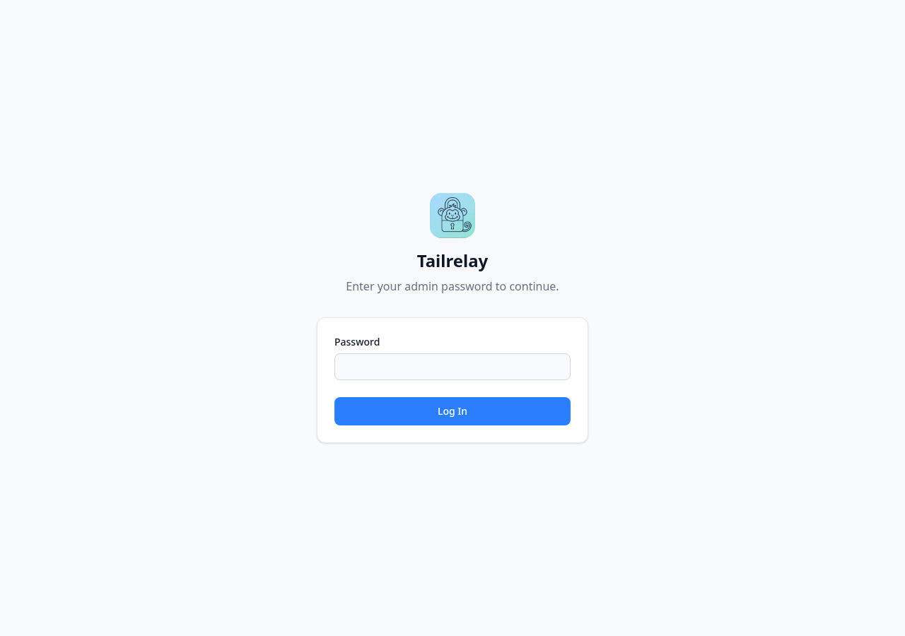</td>
  <td>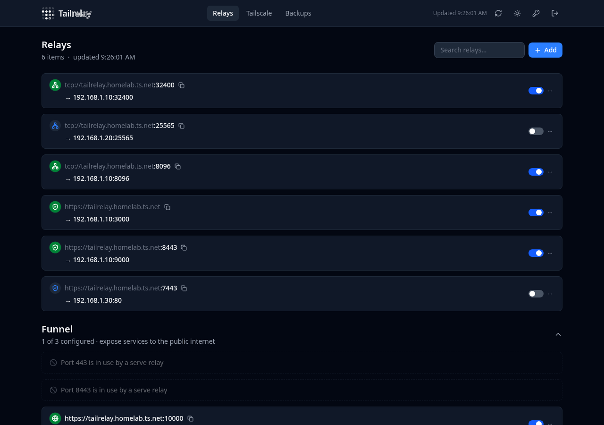</td>
</tr>
<tr>
  <th>Light — Mobile</th>
  <th>Dark — Mobile</th>
</tr>
<tr>
  <td>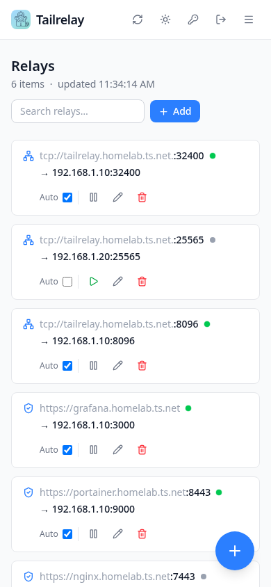</td>
  <td>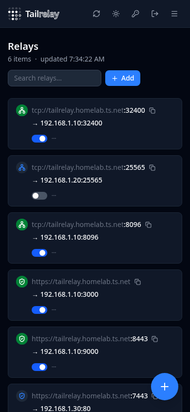</td>
</tr>
</table>

**Log console expanded (dark):**

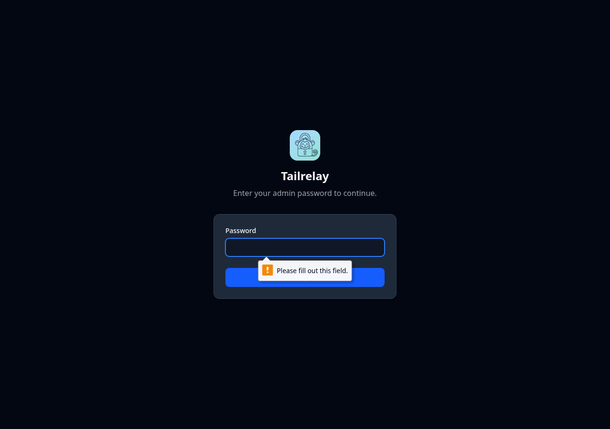

**Mobile navigation menu open:**

<table>
<tr>
  <td>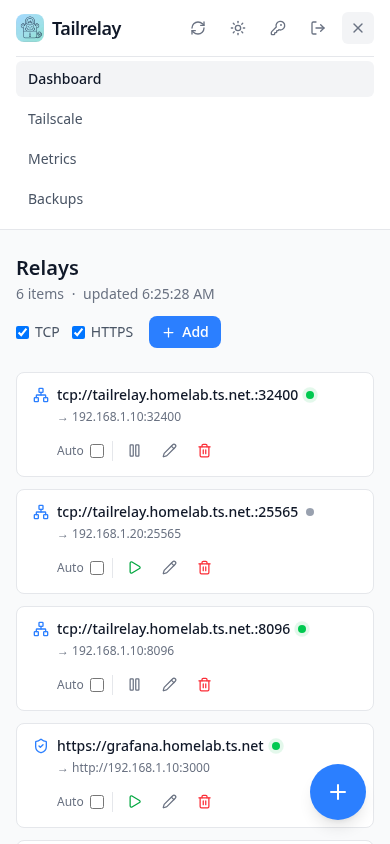</td>
  <td>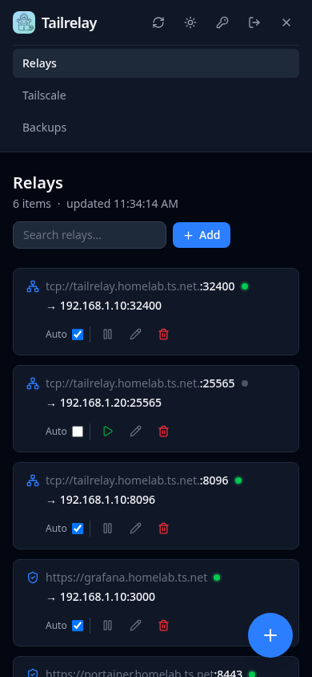</td>
</tr>
</table>

### Tailscale

<table>
<tr>
  <th>Light — Desktop</th>
  <th>Dark — Desktop</th>
</tr>
<tr>
  <td>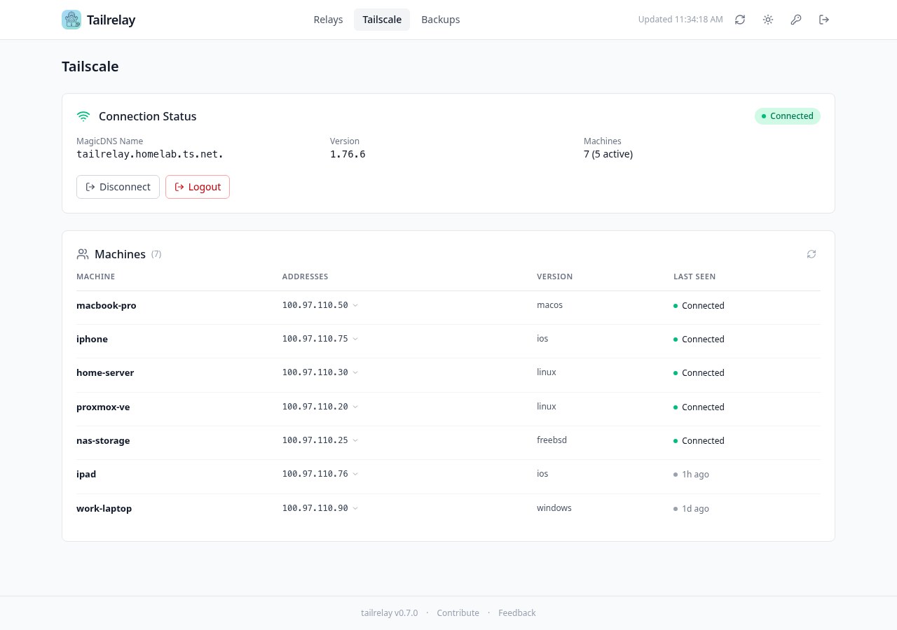</td>
  <td>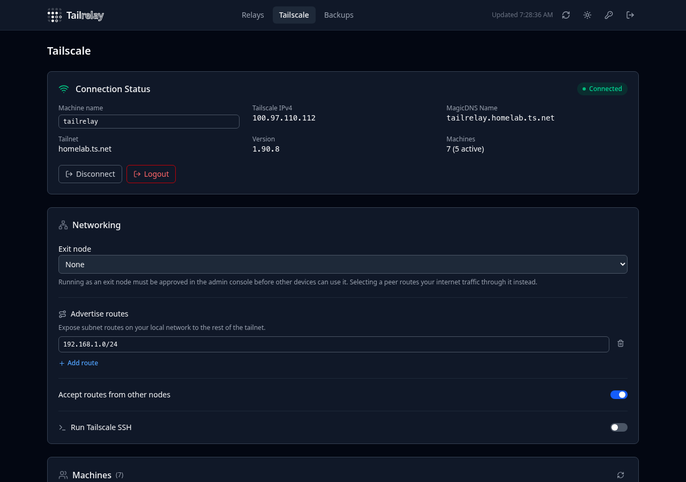</td>
</tr>
<tr>
  <th>Light — Mobile</th>
  <th>Dark — Mobile</th>
</tr>
<tr>
  <td></td>
  <td></td>
</tr>
</table>

### Metrics

<table>
<tr>
  <th>Light — Desktop</th>
  <th>Dark — Desktop</th>
</tr>
<tr>
  <td>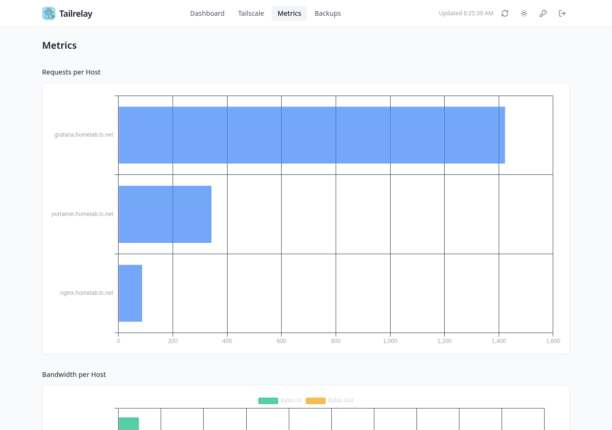</td>
  <td>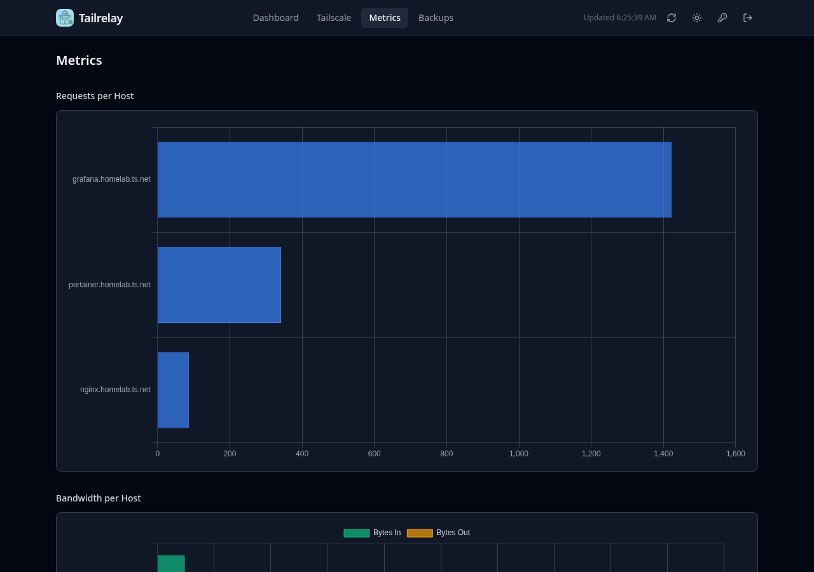</td>
</tr>
</table>

**Full-page (dark):**

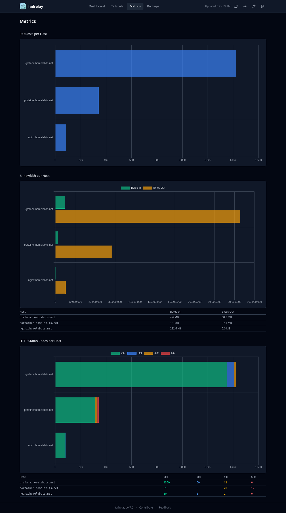

### Backups

<table>
<tr>
  <th>Light — Desktop</th>
  <th>Dark — Desktop</th>
</tr>
<tr>
  <td></td>
  <td>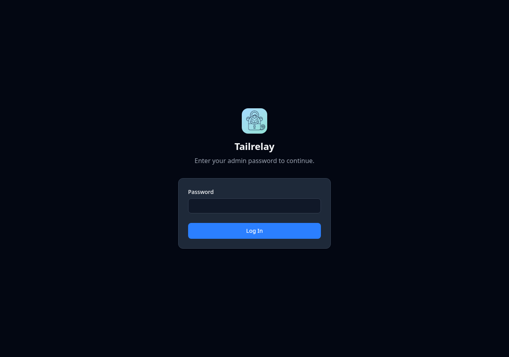</td>
</tr>
</table>

**Mobile (dark):**

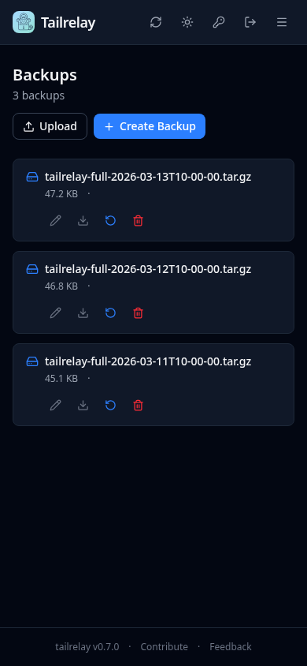


## License

Open source project. See repository for license details.


## Acknowledgments

- [Tailscale](https://tailscale.com) - VPN platform and `tailscale serve`
- [Start9](https://start9.com) - Inspiration for this project
- Original project by [@hollie](https://github.com/hollie/tailscale-caddy-proxy)

## Review Status

<!-- reviewed_at: 89eabb1 | paths: README.md webui/internal/web/server.go -->
Last full review completed at commit `89eabb1`. To check what has changed since:
```bash
git log --oneline 89eabb1..HEAD -- README.md webui/internal/web/server.go
```
